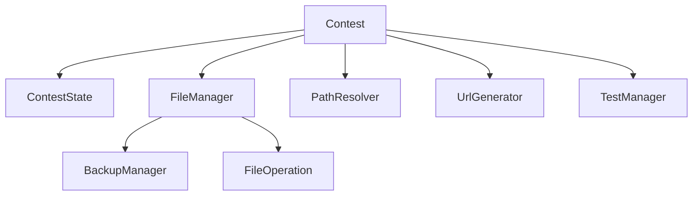

# 不足している情報の分析

## 1. プロジェクト概要の欠如

### 問題点
- プロジェクトの目的が明確でない
- 想定されるユースケースの説明がない
- 全体のアーキテクチャ図が不足

### 必要な追加情報
```markdown
# プロジェクト概要

## 目的
- プログラミングコンテストの補助ツール
- ローカル環境でのテスト実行の自動化
- 複数のコンテストサイトへの対応

## ユースケース
1. コンテスト参加時の問題ファイル作成
2. テストケースの自動生成と実行
3. 解答の提出管理
```

## 2. 設定ファイルの構造

### 問題点
- 設定ファイルのスキーマが不明確
- 必須の設定項目が明示されていない
- 設定値の制約が説明されていない

### 必要な追加情報
```yaml
# 設定ファイル構造例
system:
  contest_dir:
    active: "./contests/active"    # 作業ディレクトリ
    storage: "./contests/storage"  # 保存ディレクトリ
    template: "./templates"        # テンプレートディレクトリ
  test:
    dir: "tests"                  # テストケースディレクトリ

languages:
  rust:
    name: "rust"
    extension: "rs"
    templates:
      directory: "rust"
      patterns:
        solution: "main.{extension}"
        generator: "gen.{extension}"
        tester: "test.{extension}"

sites:
  atcoder:
    url: "https://atcoder.jp"
    problem_url: "{url}/contests/{contest}/tasks/{problem}"
    submit_url: "{url}/contests/{contest}/tasks/{problem}/submit"
```

## 3. モジュール間の依存関係

### 問題点
- モジュール間の関係性が不明確
- 各モジュールの責務の境界が曖昧
- インターフェースの利用方法が不明確

### 必要な追加情報


## 4. エラーハンドリングの方針

### 問題点
- エラーの種類と発生条件が不明確
- エラーからの回復方法が説明されていない
- エラーログの形式が定義されていない

### 必要な追加情報
```markdown
# エラーハンドリング方針

## エラーの種類
1. 設定エラー（ConfigError）
   - 設定ファイルの読み込み失敗
   - 必須設定の欠落
   - 値の検証エラー

2. ファイルシステムエラー（FileSystemError）
   - ファイル/ディレクトリの作成失敗
   - 権限エラー
   - パス解決エラー

3. バリデーションエラー（ValidationError）
   - 不正な問題ID
   - サポートされていない言語
   - 必須フィールドの欠落

## エラー発生時の動作
1. ロールバック可能な操作
   - バックアップの作成
   - エラー発生時の自動ロールバック
   - クリーンアップ処理の実行

2. ロールバック不可能な操作
   - エラーの記録
   - 現在の状態の保存
   - 手動リカバリーの手順提供
```

## 5. テスト戦略

### 問題点
- テストの範囲が不明確
- テストデータの準備方法が説明されていない
- CI/CDとの統合方法が不足

### 必要な追加情報
```markdown
# テスト戦略

## テストレベル
1. ユニットテスト
   - 各モジュールの独立したテスト
   - モックの使用方針
   - カバレッジ目標

2. 統合テスト
   - モジュール間の結合テスト
   - 外部システムとの連携テスト
   - エラーケースの検証

3. E2Eテスト
   - 実際のコンテストサイトとの連携
   - 完全な問題解決フロー
   - パフォーマンステスト
```

## 6. 開発環境とツール

### 問題点
- 必要な開発環境の説明が不足
- 使用するツールの一覧がない
- ビルドと実行の手順が不明確

### 必要な追加情報
```markdown
# 開発環境とツール

## 必要な環境
- Rust 1.70以上
- cargo-make
- openssl-dev
- その他の依存パッケージ

## 開発ツール
- rustfmt（コード整形）
- clippy（静的解析）
- cargo-audit（セキュリティチェック）

## ビルドと実行
1. 開発ビルド
   ```bash
   cargo build
   ```

2. リリースビルド
   ```bash
   cargo build --release
   ```

3. テストの実行
   ```bash
   cargo test
   ```
```

## まとめ

これらの情報を追加することで、以下の利点が得られます：

1. **プロジェクトの理解促進**
   - 目的と機能の明確化
   - アーキテクチャの把握
   - 使用方法の理解

2. **開発効率の向上**
   - 設定方法の明確化
   - エラー対応の効率化
   - テスト方針の統一

3. **保守性の向上**
   - 依存関係の把握
   - エラー処理の一貫性
   - テストの網羅性 