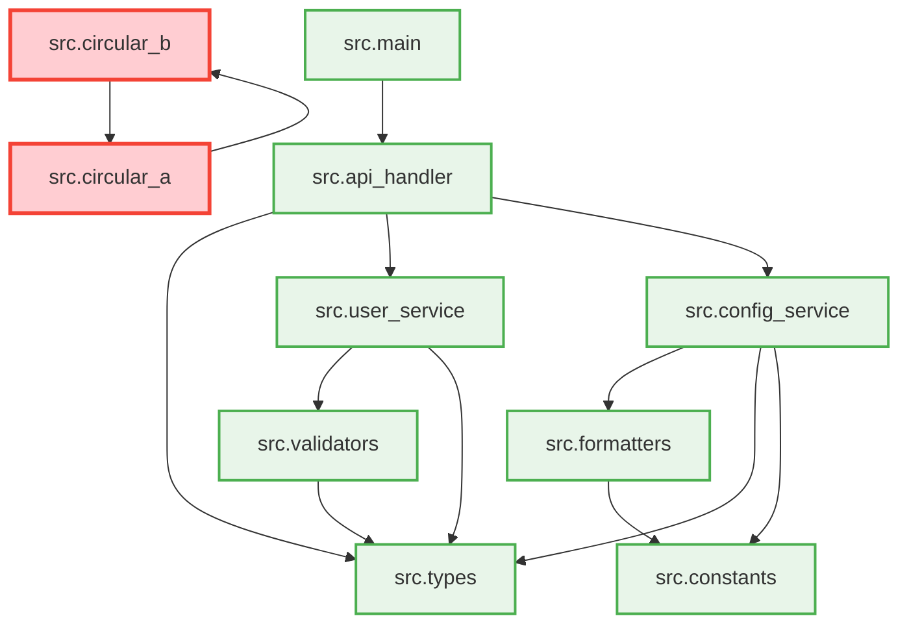

```mermaid
graph TD
    N0["src.circular_b"]:::circular
    N1["src.user_service"]:::depth0
    N2["src.types"]:::depth0
    N3["src.constants"]:::depth0
    N4["src.validators"]:::depth0
    N5["src.circular_a"]:::circular
    N6["src.main"]:::depth0
    N7["src.config_service"]:::depth0
    N8["src.api_handler"]:::depth0
    N9["src.formatters"]:::depth0
    
    N5 --> N0
    N4 --> N2
    N0 --> N5
    N7 --> N9
    N7 --> N2
    N7 --> N3
    N6 --> N8
    N8 --> N2
    N8 --> N1
    N8 --> N7
    N9 --> N3
    N1 --> N4
    N1 --> N2
    
    classDef depth0 fill:#e8f5e9,stroke:#4caf50,stroke-width:2px;
    classDef depth1 fill:#c8e6c9,stroke:#4caf50,stroke-width:2px;
    classDef depth2 fill:#a5d6a7,stroke:#4caf50,stroke-width:2px;
    classDef depth3 fill:#81c784,stroke:#4caf50,stroke-width:2px;
    classDef depth4 fill:#66bb6a,stroke:#4caf50,stroke-width:2px;
    classDef circular fill:#ffcdd2,stroke:#f44336,stroke-width:3px;
```