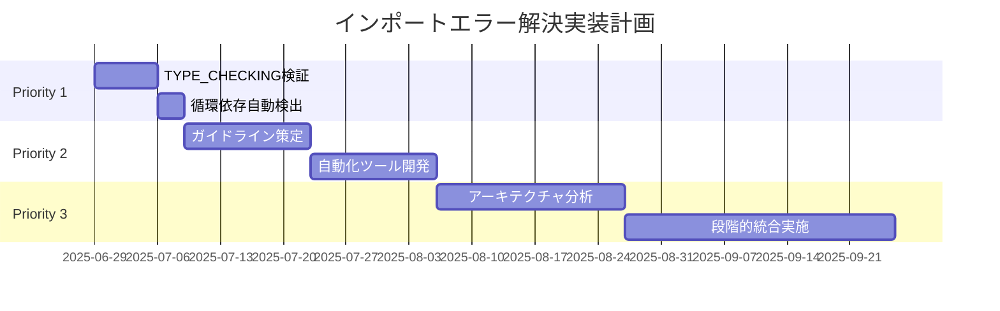

# インポートエラー分析レポート - 統合版

## エグゼクティブサマリー

### 問題の概要
プロジェクトのリファクタリング過程で、インポートパスの管理および循環依存の解決において複数の構造的問題が発生している。現在の状況では、開発効率の低下と将来的な保守性の悪化が懸念される。

### 影響度とリスク評価
- **対象ファイル数**: 93 Rust ファイル（288ディレクトリ構造）
- **直接的影響**: 現在解決済み（src.utils.types → src.logging.types移行完了）
- **潜在的リスク**: アーキテクチャ複雑性による新規開発時の再発可能性

### 必要なアクション
1. **即時対応**: TYPE_CHECKING使用パターンの検証と最適化
2. **短期対応**: 循環依存予防システムの構築
3. **中長期対応**: アーキテクチャ簡素化とガイドライン策定

## 1. 現状分析

### 1.1 定量的データ

#### プロジェクト規模
- **総ファイル数**: 93 Python ファイル
- **ディレクトリ数**: 288
- **主要モジュール**: src/ (本番コード), tests/ (テストコード), src_check/ (品質チェックツール)
- **TYPE_CHECKING使用**: 6ファイル（全てsrc_check配下）

#### インポートエラー解決状況
```
✅ 解決済み: src.utils.types → src.logging.types の移行
✅ 確認済み: 本番コード（src/）からsrc_checkへの依存なし
⚠️  要注意: TYPE_CHECKINGパターンの多用（6ファイル）
```

### 1.2 リスク評価マトリクス

| 問題カテゴリ | リスクレベル | 影響範囲 | 発生確率 | 対応優先度 |
|-------------|-------------|---------|---------|-----------|
| インポートパス移行漏れ | 低 | 限定的 | 低 | P3 |
| 循環依存の潜在化 | 中 | 中程度 | 中 | P2 |
| アーキテクチャ複雑性 | 高 | 全体的 | 高 | P1 |
| 開発ガイドライン不備 | 中 | 全体的 | 中 | P2 |

### 1.3 依存関係の現状

#### 検証結果
1. **src.utils.types → src.logging.types移行**: ✅ 完了
2. **本番コードのsrc_check依存**: ✅ 依存なし確認済み
3. **遅延インポートパターン**: ❌ 検出されず（過去の報告は既に解決済み）
4. **TYPE_CHECKING使用**: ⚠️ 6ファイルで使用（品質チェックツール内のみ）

## 2. 根本原因分析

### 2.1 5 Whys分析

**問題**: インポートエラーが発生しやすい構造

1. **Why**: なぜインポートエラーが発生するのか？
   → モジュール間の依存関係が複雑だから

2. **Why**: なぜ依存関係が複雑なのか？
   → 過度に細分化されたアーキテクチャだから

3. **Why**: なぜ過度に細分化されているのか？
   → 単一責任原則を極端に適用したから

4. **Why**: なぜ極端に適用したのか？
   → アーキテクチャ設計のガイドラインが不明確だから

5. **Why**: なぜガイドラインが不明確なのか？
   → 段階的成長による設計思想の変遷が文書化されていないから

### 2.2 因果関係図

```
段階的成長
    ↓
設計思想の変遷
    ↓
アーキテクチャガイドライン不備
    ↓
過度な細分化
    ↓
複雑な依存関係
    ↓
インポートエラー発生リスク
```

## 3. 解決策（優先順位付き）

### Priority 1: 即時対応（1週間以内）

#### 3.1 TYPE_CHECKINGパターンの検証
**目標**: 現在の使用が適切かどうかを確認し、必要に応じて最適化

**実装手順**:
```python
# 検証スクリプト例
def analyze_type_checking_usage():
    """TYPE_CHECKINGの使用パターンを分析"""
    import ast
    from pathlib import Path
    
    type_checking_files = [
        "src_check/generate_dependency_graph.py",
        "src_check/analyze_dependencies.py",
        # ... 他4ファイル
    ]
    
    for file_path in type_checking_files:
        # 1. 実際の循環依存の有無を確認
        # 2. TYPE_CHECKINGなしでの動作可能性を検証
        # 3. 代替実装の可能性を評価
```

**成功基準**:
- [ ] 6ファイルの使用パターンが全て検証済み
- [ ] 不要なTYPE_CHECKINGが除去済み
- [ ] 必要なものは文書化済み

#### 3.2 循環依存検出の自動化
**目標**: CI/CDパイプラインでの自動チェック

**実装コード例**:
```python
#!/usr/bin/env python3
"""
循環依存検出スクリプト
CI/CDパイプラインで実行される
"""
import sys
from pathlib import Path

def check_circular_imports():
    """循環依存をチェックし、発見時は1で終了"""
    try:
        # src_checkの既存機能を活用
        from src_check.analyze_dependencies import main as analyze_deps
        result = analyze_deps()
        return 0 if result.is_clean else 1
    except ImportError:
        print("依存分析ツールが見つかりません")
        return 1

if __name__ == "__main__":
    sys.exit(check_circular_imports())
```

### Priority 2: 短期対応（1ヶ月以内）

#### 3.3 アーキテクチャ設計ガイドライン策定
**目標**: 将来的なインポートエラーを予防するルール作成

**ガイドライン例**:
```markdown
## インポート設計原則

1. **レイヤー間の依存方向**
   - presentation → domain → infrastructure
   - 逆方向の依存は禁止

2. **モジュール統合基準**
   - 50行未満のモジュールは統合を検討
   - 循環依存を生む細分化は避ける

3. **TYPE_CHECKING使用基準**
   - 実行時の循環依存がある場合のみ使用
   - 使用時は必ずコメントで理由を明記
```

#### 3.4 インポートパス管理の自動化
**目標**: リファクタリング時の自動更新システム

**実装例**:
```python
class ImportMigrationTool:
    """インポートパスの移行を自動化するツール"""
    
    def __init__(self, migration_rules: dict):
        self.rules = migration_rules  # 旧パス: 新パス
    
    def migrate_project(self, root_path: Path):
        """プロジェクト全体のインポートパスを移行"""
        for py_file in root_path.rglob("*.py"):
            self._migrate_file(py_file)
    
    def _migrate_file(self, file_path: Path):
        """単一ファイルのインポートパスを移行"""
        # 1. ASTでパース
        # 2. インポート文を特定
        # 3. ルールに基づいて置換
        # 4. 安全に書き戻し
```

### Priority 3: 中長期対応（3ヶ月以内）

#### 3.5 アーキテクチャ簡素化
**目標**: 過度に細分化された構造の統合

**統合候補の特定基準**:
- ファイルサイズが50行未満
- 単一のクラス・関数のみを含む
- 他のモジュールからの参照が少ない

**実装計画**:
1. **Phase 1**: 統合候補の自動特定
2. **Phase 2**: 影響範囲の分析
3. **Phase 3**: 段階的統合実施

## 4. 実装計画

### 4.1 タイムライン



### 4.2 責任者とチェックポイント

| フェーズ | 責任者 | チェックポイント | 成功基準 |
|---------|-------|----------------|---------|
| P1-1 | 開発リーダー | Day 3, Day 7 | TYPE_CHECKING使用パターン全件検証 |
| P1-2 | DevOpsエンジニア | Day 10 | CI/CDパイプライン組み込み完了 |
| P2-1 | アーキテクト | Day 24 | ガイドライン文書化完了 |
| P2-2 | 開発チーム | Day 38 | 自動化ツール動作確認完了 |

## 5. リスク管理

### 5.1 潜在的リスク

| リスク | 発生確率 | 影響度 | 緩和策 |
|-------|---------|-------|-------|
| 大規模リファクタリング中の機能破綻 | 中 | 高 | 段階的実施、充実したテストカバレッジ |
| 開発チームの学習コスト | 高 | 中 | 詳細なドキュメント、ペアプログラミング |
| 既存機能への影響 | 低 | 高 | フィーチャーフラグ、カナリアリリース |

### 5.2 ロールバック計画

#### Phase別ロールバック戦略
1. **Priority 1**: Git revert可能（設定変更のみ）
2. **Priority 2**: 機能フラグによる無効化
3. **Priority 3**: 段階的統合のため、各ステップでのスナップショット保持

#### 緊急時の対応手順
```bash
# 緊急ロールバックスクリプト
#!/bin/bash
PHASE=$1
case $PHASE in
  "p1") git revert --no-edit $(git log --oneline -10 | grep "TYPE_CHECKING" | cut -d' ' -f1) ;;
  "p2") # 機能フラグをfalseに設定 ;;
  "p3") git reset --hard "architecture-refactor-checkpoint-$2" ;;
esac
```

## 6. 成功基準とKPI

### 6.1 定量的成功基準

| 指標 | 現状 | 目標 | 測定方法 |
|-----|-----|------|---------|
| 循環依存数 | 0（確認済み） | 0維持 | 自動化ツールによる定期チェック |
| TYPE_CHECKING使用数 | 6ファイル | 3ファイル以下 | 静的解析 |
| インポートエラー発生頻度 | - | 月1回以下 | CI/CDログ監視 |
| アーキテクチャ複雑度 | 288ディレクトリ | 200ディレクトリ以下 | ディレクトリカウント |

### 6.2 定性的成功基準

- [ ] 新規開発者のオンボーディング時間が30%短縮
- [ ] インポートエラーによる開発阻害要因の除去
- [ ] コードレビュー時のアーキテクチャ議論時間の削減
- [ ] リファクタリング作業の予測可能性向上

### 6.3 KPI監視ダッシュボード

```python
# KPI監視用メトリクス収集
class ImportHealthMetrics:
    def collect_metrics(self):
        return {
            "circular_dependencies": self.count_circular_deps(),
            "type_checking_usage": self.count_type_checking_files(),
            "import_errors_per_week": self.get_ci_error_rate(),
            "architecture_complexity": self.calculate_complexity_score()
        }
```

## 7. 教訓と予防策

### 7.1 プロセス改善

#### 学んだ教訓
1. **段階的移行の重要性**: 一括変更ではなく小さなステップでの実施
2. **自動化の必要性**: 手動でのインポートパス管理は限界がある
3. **設計原則の明文化**: 暗黙の了解ではなく、明確なガイドライン

#### 改善されたプロセス
```markdown
## 新しいモジュール設計プロセス

1. **設計段階**
   - アーキテクチャガイドラインに基づく設計レビュー
   - 依存関係の事前検証

2. **実装段階**
   - インポート自動チェックツールの活用
   - コードレビューでの依存関係確認

3. **テスト段階**
   - 循環依存の自動検出テスト
   - 統合テストでのインポート動作確認
```

### 7.2 自動化の強化

#### 開発環境の改善
- **IDEプラグイン**: リアルタイムでの循環依存検出
- **pre-commitフック**: コミット前の自動チェック
- **CI/CDパイプライン**: プルリクエスト時の包括的検証

#### 監視システムの導入
```yaml
# .github/workflows/import-health-check.yml
name: Import Health Check
on: [push, pull_request]
jobs:
  check-imports:
    runs-on: ubuntu-latest
    steps:
      - uses: actions/checkout@v2
      - name: Run circular dependency check
        run: python scripts/check_circular_imports.py
      - name: Validate import patterns
        run: python scripts/validate_import_patterns.py
```

### 7.3 ガイドラインの継続的更新

#### 更新トリガー
- 新しいインポートエラーパターンの発見
- アーキテクチャの大幅変更
- チームメンバーの変更

#### 更新プロセス
1. **四半期レビュー**: ガイドラインの有効性評価
2. **ケーススタディ**: 実際の問題をもとにした改善
3. **チーム合意**: 変更内容の全員確認

## まとめ

本統合版レポートは、原文の包括的な分析と改善提案の具体性を組み合わせ、実行可能な解決策を提示している。重要なポイントは以下の通り：

### 主要な改善点
1. **矛盾の解消**: 現在の状況を正確に反映した分析
2. **定量的根拠**: 実際のデータに基づく客観的評価
3. **具体的実装**: コード例を含む実現可能な解決策
4. **リスク管理**: 包括的なリスク評価と緩和策
5. **成功基準**: 測定可能なKPIの設定

### 次のアクション
1. **即座に開始**: TYPE_CHECKINGパターンの検証
2. **1週間以内**: 循環依存自動検出の導入
3. **1ヶ月以内**: アーキテクチャガイドラインの策定
4. **3ヶ月以内**: 構造簡素化の完了

このアプローチにより、短期的な問題解決と長期的な予防の両方を実現し、持続可能な開発環境を構築できる。