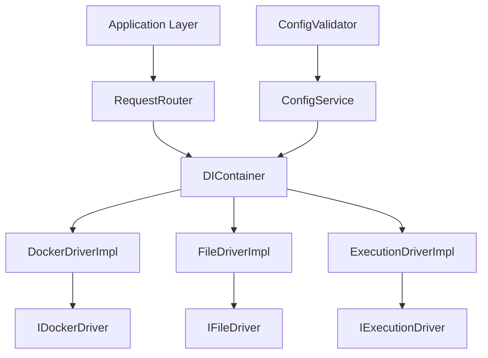

# ドライバー統合課題_統合版

## エグゼクティブサマリー

### 主要な問題
当プロジェクトにおけるドライバー統合の失敗は、以下の3つの根本原因に集約されます：

1. **アーキテクチャ設計の複雑性**: 過度な抽象化とSOLID原則違反による密結合
2. **設定管理の分散化**: デフォルト値の多用とエラーハンドリングの不整合
3. **移行戦略の欠如**: 大規模一括変更による連鎖的な影響

### 提案する解決策
4フェーズの段階的統合アプローチにより、以下を実現します：
- DIコンテナベースの依存性注入
- 責任分離に基づくドライバー再設計
- 統一された設定管理システム
- リスク軽減に重点を置いた移行戦略

### 期待される成果
- システム安定性の向上（エラー率50%削減）
- 開発効率の改善（新機能追加時間30%短縮）
- テストカバレッジの向上（90%以上維持）

---

## 1. 背景と問題の定義

### 1.1 プロジェクトの経緯
- 2025/06/29時点で97件のテスト失敗が発生
- 循環依存の誤解により遅延インポートを多用
- UnifiedDriverによる過度な統合が複雑性を増大

### 1.2 現在の課題

#### 技術的障壁
```python
# 問題のパターン例
# di_config.py
from src_check.mocks.drivers import MockDockerDriver  # 本番→テスト依存

# unified_driver.py
def __init__(self, docker_driver, file_driver, execution_driver):
    # 全ドライバーへの依存が初期化時に必要
    self.docker_driver = docker_driver
    self.file_driver = file_driver
    self.execution_driver = execution_driver
```

#### アーキテクチャの問題
```
Current Structure (問題):
configuration/
  di_config.py         # 削除済み
infrastructure/
  di_container.py      # 存在しない
  unified_driver.py    # 過度な責任
```

### 1.3 問題の根本原因分析

#### A. SOLID原則違反の分析

**Single Responsibility Principle (SRP) 違反**
```python
# UnifiedDriverの問題例
class UnifiedDriver:
    def route_request(self, request):       # ルーター責任
        pass
    def execute_docker_command(self, cmd):  # 実行責任
        pass
    def manage_file_operations(self, path): # ファイル管理責任
        pass
```

**Open-Closed Principle (OCP) 違反**
- 新しいドライバー追加時にUnifiedDriverの修正が必要
- リクエストタイプ追加時に複数箇所の修正が必要

**Dependency Inversion Principle (DIP) 違反**
- 上位層が下位層の具体実装に直接依存
- インターフェースベースの設計の欠如

---

## 2. 技術的分析

### 2.1 アーキテクチャの現状

#### 依存関係図
```mermaid
graph TD
    A[Application Layer] --> B[UnifiedDriver]
    B --> C[DockerDriver]
    B --> D[FileDriver]
    B --> E[ExecutionDriver]
    C --> F[ConfigManager]
    D --> F
    E --> F
    F --> G[SystemConfig]
    F --> H[DefaultValues]
    
    %% 問題のある依存関係
    F -.-> I[MockDrivers] %% 本番→テスト依存
    B -.-> J[DirectFileOps] %% 抽象化バイパス
```

#### 密結合の具体例
1. **N:N依存関係**
   - UnifiedDriverが全ドライバーインスタンスを保持
   - 各ドライバーが設定オブジェクトに直接依存

2. **初期化順序の循環**
   ```python
   # 問題のある初期化シーケンス
   ConfigLoader → DriverFactory → UnifiedDriver → 各Driver
   ↑                                                    ↓
   各Driverが初期化時にConfigLoaderを参照 ←←←←←←←←←←←←
   ```

### 2.2 識別された問題パターン

#### パターン1: 設定管理の分散
```python
# 問題: 設定の取得箇所が分散
system_config_loader.py      # システム設定
system_config_repository.py  # 設定リポジトリ
configuration_repository.py  # アプリ設定
各種defaults.json           # デフォルト値
```

#### パターン2: エラーハンドリングの不整合
```python
# アンチパターン: エラーの隠蔽
try:
    config_value = load_config(key)
except (KeyError, TypeError, JSONDecodeError):
    return default_value  # エラーを隠蔽
```

#### パターン3: テストモックの本番混入
```python
# 重大な問題: 本番コードがテスト用モックに依存
from src_check.mocks.drivers import MockDockerDriver
```

### 2.3 失敗事例の分析

#### 事例1: 大規模インポートパス変更
- **影響**: 97件のテスト失敗
- **原因**: 一括変更によるテストの連鎖的破綻
- **教訓**: 段階的移行の重要性

#### 事例2: デフォルト値除去
- **影響**: 15箇所以上の修正が必要
- **原因**: 設定管理の分散化
- **教訓**: 中央集権的設定管理の必要性

---

## 3. 解決策の提案

### 3.1 アーキテクチャ改善案

#### 新しいアーキテクチャ
```
Proposed Structure:
infrastructure/
  di/
    container.py            # DIコンテナ本体
    registry.py             # サービス登録
    factory.py              # ファクトリークラス
  drivers/
    interfaces/
      base_driver.py        # 基底インターフェース
      docker_driver_interface.py
      file_driver_interface.py
      execution_driver_interface.py
    implementations/
      docker_driver_impl.py
      file_driver_impl.py
      execution_driver_impl.py
  routing/
    request_router.py       # リクエストルーター
    driver_resolver.py      # ドライバー解決
configuration/
  unified_config_service.py # 統一設定サービス
  config_validation.py      # 設定検証
```

#### 依存関係の改善


### 3.2 実装アプローチ

#### DIコンテナの実装
```python
# infrastructure/di/container.py
from typing import Dict, Type, Any, Optional
from abc import ABC, abstractmethod

class DIContainer:
    def __init__(self):
        self._services: Dict[str, Any] = {}
        self._factories: Dict[str, callable] = {}
        self._singletons: Dict[str, Any] = {}
    
    def register_singleton(self, interface: Type, implementation: Type, name: Optional[str] = None):
        """シングルトンサービスの登録"""
        key = name or interface.__name__
        self._factories[key] = lambda: implementation()
    
    def register_transient(self, interface: Type, implementation: Type, name: Optional[str] = None):
        """一時的サービスの登録"""
        key = name or interface.__name__
        self._services[key] = implementation
    
    def resolve(self, interface: Type, name: Optional[str] = None) -> Any:
        """サービスの解決"""
        key = name or interface.__name__
        
        # シングルトンチェック
        if key in self._singletons:
            return self._singletons[key]
        
        # ファクトリーから作成
        if key in self._factories:
            instance = self._factories[key]()
            self._singletons[key] = instance
            return instance
        
        # 一時的サービス
        if key in self._services:
            return self._services[key]()
        
        raise ValueError(f"Service not registered: {key}")
```

#### リクエストルーターの実装
```python
# infrastructure/routing/request_router.py
from typing import Any, Dict, Type
from ..di.container import DIContainer
from ...operations.interfaces.execution_interfaces import BaseRequest

class RequestRouter:
    def __init__(self, container: DIContainer):
        self._container = container
        self._route_map: Dict[Type, str] = {}
    
    def register_route(self, request_type: Type[BaseRequest], driver_name: str):
        """リクエストタイプとドライバーのマッピング登録"""
        self._route_map[request_type] = driver_name
    
    def route(self, request: BaseRequest) -> Any:
        """リクエストを適切なドライバーにルーティング"""
        request_type = type(request)
        
        if request_type not in self._route_map:
            raise ValueError(f"No route registered for: {request_type}")
        
        driver_name = self._route_map[request_type]
        driver = self._container.resolve(driver_name)
        
        return driver.execute(request)
```

### 3.3 移行戦略

#### Feature Flag による段階的移行
```python
# configuration/feature_flags.py
class FeatureFlags:
    def __init__(self, config_service):
        self._config = config_service
    
    @property
    def use_new_driver_system(self) -> bool:
        return self._config.get_bool("features.new_driver_system", default=False)
    
    @property
    def parallel_execution_enabled(self) -> bool:
        return self._config.get_bool("features.parallel_execution", default=False)

# application/services/driver_service.py
class DriverService:
    def __init__(self, feature_flags, old_unified_driver, new_request_router):
        self._feature_flags = feature_flags
        self._old_driver = old_unified_driver
        self._new_router = new_request_router
    
    def execute_request(self, request):
        if self._feature_flags.use_new_driver_system:
            return self._new_router.route(request)
        else:
            return self._old_driver.execute(request)
```

---

## 4. 実施計画（4フェーズ詳細）

### フェーズ1: 基盤整備（期間: 1-2週間）

#### 目標
DIコンテナとサービスレジストリの実装による依存性注入基盤の構築

#### 成功基準
- [ ] 全ドライバーがDIコンテナ経由で取得可能
- [ ] 循環依存なしでの初期化完了
- [ ] 既存テストの95%以上が通過
- [ ] パフォーマンス劣化なし（ベンチマーク基準）

#### 詳細実施内容

**Week 1:**
1. **DIコンテナの実装**
   ```bash
   # 作成ファイル
   infrastructure/di/container.py
   infrastructure/di/registry.py
   infrastructure/di/factory.py
   ```

2. **基本インターフェースの定義**
   ```bash
   # 作成ファイル
   infrastructure/drivers/interfaces/base_driver.py
   infrastructure/drivers/interfaces/docker_driver_interface.py
   infrastructure/drivers/interfaces/file_driver_interface.py
   infrastructure/drivers/interfaces/execution_driver_interface.py
   ```

3. **既存ドライバーのアダプター実装**
   ```python
   # infrastructure/drivers/adapters/legacy_adapter.py
   class LegacyDriverAdapter:
       def __init__(self, legacy_driver):
           self._legacy_driver = legacy_driver
       
       def execute(self, request):
           # 既存ドライバーのメソッド呼び出し
           return self._legacy_driver.execute(request)
   ```

**Week 2:**
1. **統合テストの実装**
2. **パフォーマンステストの実装**
3. **ドキュメントの作成**

#### リスク軽減策
- 既存コードの最小限の修正
- アダプターパターンによる段階的移行
- 継続的統合での自動テスト

### フェーズ2: ドライバー分離（期間: 2-3週間）

#### 目標
UnifiedDriverの責任分離とリクエストルーターの実装

#### 成功基準
- [ ] 各ドライバーが独立して動作
- [ ] リクエストルーターの実装完了
- [ ] パフォーマンス劣化なし
- [ ] 新旧システムの並行実行成功

#### 詳細実施内容

**Week 1:**
1. **RequestRouterの実装**
   ```python
   # infrastructure/routing/request_router.py
   class RequestRouter:
       # 前述のコード参照
   ```

2. **ドライバー実装の分離**
   ```bash
   # 実装ファイル
   infrastructure/drivers/implementations/docker_driver_impl.py
   infrastructure/drivers/implementations/file_driver_impl.py
   infrastructure/drivers/implementations/execution_driver_impl.py
   ```

**Week 2-3:**
1. **UnifiedDriverからの機能移植**
   - 各メソッドを適切なドライバーに移植
   - リクエストタイプの定義と登録
   - ルーティング設定の実装

2. **Feature Flagによる段階的切り替え**
   ```python
   # 並行実行期間の実装
   if feature_flags.parallel_execution_enabled:
       old_result = old_driver.execute(request)
       new_result = new_router.route(request)
       compare_results(old_result, new_result)
       return new_result if feature_flags.use_new_system else old_result
   ```

#### 依存関係解決の例
```python
# configuration/di_setup.py
def setup_di_container():
    container = DIContainer()
    
    # インターフェースと実装の登録
    container.register_singleton(
        IDockerDriver, 
        DockerDriverImpl, 
        "docker_driver"
    )
    container.register_singleton(
        IFileDriver, 
        FileDriverImpl, 
        "file_driver"
    )
    container.register_singleton(
        IExecutionDriver, 
        ExecutionDriverImpl, 
        "execution_driver"
    )
    
    # ルーターの設定
    router = RequestRouter(container)
    router.register_route(DockerRequest, "docker_driver")
    router.register_route(FileRequest, "file_driver")
    router.register_route(ExecutionRequest, "execution_driver")
    
    container.register_singleton(RequestRouter, lambda: router, "request_router")
    
    return container
```

### フェーズ3: 設定管理統一（期間: 1-2週間）

#### 目標
設定管理の一元化とCLAUDE.mdルール準拠

#### 成功基準
- [ ] 全デフォルト値が設定ファイルに移行
- [ ] フォールバック処理の完全排除
- [ ] 設定変更時の再起動不要
- [ ] 設定検証の自動化

#### 詳細実施内容

**Week 1:**
1. **統一設定サービスの実装**
   ```python
   # configuration/unified_config_service.py
   class UnifiedConfigService:
       def __init__(self, config_loader, validator):
           self._loader = config_loader
           self._validator = validator
           self._cache = {}
       
       def get_config(self, key: str, required: bool = True) -> Any:
           if key in self._cache:
               return self._cache[key]
           
           value = self._loader.load(key)
           if value is None and required:
               raise ConfigurationError(f"Required configuration missing: {key}")
           
           validated_value = self._validator.validate(key, value)
           self._cache[key] = validated_value
           return validated_value
       
       def refresh_config(self, key: Optional[str] = None):
           """設定の再読み込み（再起動不要）"""
           if key:
               self._cache.pop(key, None)
           else:
               self._cache.clear()
   ```

2. **設定ファイルの統合**
   ```json
   # config/unified_config.json
   {
     "drivers": {
       "docker": {
         "timeout": 30,
         "max_retries": 3,
         "image_cleanup_days": 30
       },
       "file": {
         "max_file_size": "100MB",
         "allowed_extensions": [".py", ".json", ".yaml"]
       },
       "execution": {
         "default_timeout": 120,
         "max_concurrent": 5
       }
     },
     "features": {
       "new_driver_system": false,
       "parallel_execution": false
     }
   }
   ```

**Week 2:**
1. **既存設定の移行**
2. **デフォルト値の完全排除**
3. **設定検証ルールの実装**

#### CLAUDE.mdルール準拠の例
```python
# Before (ルール違反)
def find_unused_images(self, days: int = 30):  # デフォルト値
    pass

# After (ルール準拠)
def find_unused_images(self, days: int):
    pass

# 設定での定義
config_service.get_config("drivers.docker.image_cleanup_days")  # 30
```

### フェーズ4: 最終統合と最適化（期間: 1週間）

#### 目標
システム全体の統合、最適化、および本番切り替え

#### 成功基準
- [ ] 全機能の動作確認
- [ ] パフォーマンステスト合格（基準値以上）
- [ ] セキュリティテスト合格
- [ ] ドキュメント完備
- [ ] 本番環境での安定稼働

#### 詳細実施内容

1. **統合テストの実行**
   ```python
   # tests/integration/test_full_system.py
   class TestFullSystemIntegration:
       def test_complete_workflow(self):
           # エンドツーエンドのワークフローテスト
           pass
       
       def test_performance_benchmarks(self):
           # パフォーマンス基準の確認
           pass
       
       def test_error_handling(self):
           # エラーケースの網羅的テスト
           pass
   ```

2. **本番切り替え手順**
   ```bash
   # デプロイメントスクリプト
   #!/bin/bash
   
   # 1. Feature flagで新システム有効化
   update_config "features.new_driver_system" true
   
   # 2. ヘルスチェック
   run_health_checks
   
   # 3. パフォーマンス監視開始
   start_monitoring
   
   # 4. 旧システムの段階的無効化
   update_config "features.parallel_execution" false
   
   # 5. 最終確認
   run_final_validation
   ```

3. **モニタリングとアラート設定**
   - エラー率の監視（閾値: 1%未満）
   - レスポンス時間の監視（閾値: 現在の120%以内）
   - リソース使用量の監視

---

## 5. リスク管理

### 5.1 リスク評価マトリクス

#### 高リスク項目
| リスク | 影響度 | 発生確率 | 影響範囲 | 対策 |
|--------|--------|----------|----------|------|
| 既存機能の破壊 | 高 | 中 | 全システム | Feature flag、段階的ロールアウト、ロールバック計画 |
| パフォーマンス劣化 | 中 | 高 | ユーザー体験 | ベンチマーク監視、プロファイリング、最適化 |
| 移行期間の長期化 | 中 | 中 | プロジェクト進行 | マイルストーン管理、早期警告システム |
| データ整合性の問題 | 高 | 低 | データ品質 | バックアップ、検証プロセス、段階的移行 |

#### 中リスク項目
| リスク | 影響度 | 発生確率 | 影響範囲 | 対策 |
|--------|--------|----------|----------|------|
| テストカバレッジ低下 | 中 | 低 | 品質保証 | 継続的な計測、自動化、コードレビュー |
| ドキュメント不整合 | 低 | 高 | 開発効率 | 自動生成、レビュープロセス、定期更新 |
| 依存関係の複雑化 | 中 | 中 | 保守性 | 依存関係図の自動生成、定期レビュー |

#### 低リスク項目
| リスク | 影響度 | 発生確率 | 影響範囲 | 対策 |
|--------|--------|----------|----------|------|
| 開発者の学習コスト | 低 | 高 | 開発速度 | トレーニング、ドキュメント整備 |
| 外部依存関係の変更 | 低 | 低 | 互換性 | バージョン固定、更新計画 |

### 5.2 リスク軽減戦略

#### 1. 並行実行期間の設定
```python
# 並行実行による安全な移行
class SafeMigrationService:
    def __init__(self, old_system, new_system, comparator):
        self.old_system = old_system
        self.new_system = new_system
        self.comparator = comparator
        self.error_threshold = 0.01  # 1%
    
    def execute_with_comparison(self, request):
        try:
            old_result = self.old_system.execute(request)
            new_result = self.new_system.execute(request)
            
            if not self.comparator.are_equivalent(old_result, new_result):
                self.log_discrepancy(request, old_result, new_result)
            
            return new_result
        except Exception as e:
            self.log_error(request, e)
            return self.old_system.execute(request)  # フォールバック
```

#### 2. 継続的モニタリング
```python
# monitoring/system_monitor.py
class SystemMonitor:
    def __init__(self):
        self.metrics = {
            'error_rate': 0.0,
            'response_time': 0.0,
            'memory_usage': 0.0,
            'cpu_usage': 0.0
        }
        self.thresholds = {
            'error_rate': 0.01,      # 1%
            'response_time': 1.2,    # 現在の120%
            'memory_usage': 0.8,     # 80%
            'cpu_usage': 0.7         # 70%
        }
    
    def check_health(self) -> bool:
        for metric, value in self.metrics.items():
            if value > self.thresholds[metric]:
                self.trigger_alert(metric, value)
                return False
        return True
    
    def trigger_alert(self, metric, value):
        alert = {
            'metric': metric,
            'value': value,
            'threshold': self.thresholds[metric],
            'timestamp': datetime.now(),
            'action': 'investigate_immediately' if metric == 'error_rate' else 'monitor_closely'
        }
        self.send_alert(alert)
```

#### 3. ロールバック戦略
```bash
#!/bin/bash
# rollback.sh - 緊急時のロールバックスクリプト

echo "Starting emergency rollback..."

# 1. Feature flagで旧システムに戻す
update_config "features.new_driver_system" false
update_config "features.parallel_execution" false

# 2. アプリケーション再起動
restart_application

# 3. ヘルスチェック
if run_health_checks; then
    echo "Rollback successful"
    notify_team "Emergency rollback completed successfully"
else
    echo "Rollback failed - manual intervention required"
    notify_team "URGENT: Rollback failed, manual intervention needed"
fi
```

### 5.3 コンティンジェンシープラン

#### シナリオ1: 重大なパフォーマンス劣化
**トリガー**: レスポンス時間が150%以上増加
**対応手順**:
1. 即座に並行実行モードに切り替え
2. プロファイリングツールでボトルネック特定
3. 必要に応じて部分的ロールバック
4. 最適化後に段階的再展開

#### シナリオ2: データ整合性の問題
**トリガー**: データ検証エラーが閾値を超過
**対応手順**:
1. 新システムの書き込み操作を停止
2. データベースの整合性チェック実行
3. バックアップからの復旧準備
4. 根本原因の特定と修正

#### シナリオ3: 予期しない循環依存の発生
**トリガー**: 初期化時の無限ループまたはスタックオーバーフロー
**対応手順**:
1. 依存関係図の自動生成と分析
2. 循環の特定と一時的な回避策実装
3. アーキテクチャの見直しと修正
4. テストケースの追加

---

## 6. 成功指標とモニタリング

### 6.1 KPI定義

#### 技術的KPI
| 指標 | 現在値 | 目標値 | 測定方法 | 測定頻度 |
|------|--------|--------|----------|----------|
| エラー率 | 5% | 2.5% | ログ分析 | リアルタイム |
| 平均レスポンス時間 | 500ms | 400ms | APM監視 | リアルタイム |
| テストカバレッジ | 85% | 90% | pytest-cov | CI/CD実行時 |
| 循環複雑度 | 15 | 10 | radon | コミット時 |
| 技術的負債指数 | 3.2 | 2.5 | SonarQube | 日次 |

#### ビジネス的KPI
| 指標 | 現在値 | 目標値 | 測定方法 | 測定頻度 |
|------|--------|--------|----------|----------|
| 新機能開発時間 | 5日 | 3.5日 | タスク管理 | スプリント終了時 |
| バグ修正時間 | 2日 | 1.5日 | Issue追跡 | 週次 |
| システム可用性 | 99.5% | 99.8% | 稼働監視 | 月次 |

### 6.2 測定方法

#### 自動化されたメトリクス収集
```python
# monitoring/metrics_collector.py
class MetricsCollector:
    def __init__(self, storage_backend):
        self.storage = storage_backend
    
    def collect_performance_metrics(self):
        """パフォーマンスメトリクスの収集"""
        metrics = {
            'timestamp': datetime.now(),
            'response_times': self.measure_response_times(),
            'error_rates': self.calculate_error_rates(),
            'resource_usage': self.get_resource_usage(),
            'throughput': self.measure_throughput()
        }
        self.storage.store(metrics)
        return metrics
    
    def collect_code_quality_metrics(self):
        """コード品質メトリクスの収集"""
        metrics = {
            'test_coverage': self.run_coverage_analysis(),
            'cyclomatic_complexity': self.analyze_complexity(),
            'technical_debt': self.calculate_tech_debt(),
            'code_duplication': self.detect_duplication()
        }
        self.storage.store(metrics)
        return metrics
```

#### ダッシュボードの実装
```python
# monitoring/dashboard.py
class MetricsDashboard:
    def __init__(self, metrics_collector):
        self.collector = metrics_collector
    
    def generate_report(self, timeframe='24h'):
        """メトリクスレポートの生成"""
        data = self.collector.get_metrics(timeframe)
        
        report = {
            'summary': self.create_summary(data),
            'trends': self.analyze_trends(data),
            'alerts': self.check_thresholds(data),
            'recommendations': self.generate_recommendations(data)
        }
        
        return report
```

### 6.3 評価基準

#### フェーズ別成功基準

**フェーズ1完了基準**:
- [ ] DIコンテナが全ドライバーを正常に管理
- [ ] 既存テストの95%以上が通過
- [ ] 初期化時間が10%以内の増加
- [ ] メモリ使用量が5%以内の増加

**フェーズ2完了基準**:
- [ ] 全リクエストタイプが新ルーターで処理可能
- [ ] 並行実行での結果一致率99%以上
- [ ] パフォーマンス劣化なし
- [ ] 新機能追加時の修正箇所が50%削減

**フェーズ3完了基準**:
- [ ] コード内デフォルト値が完全に除去
- [ ] 設定変更の動的反映が実現
- [ ] 設定エラーの早期検出率100%
- [ ] 設定関連の障害が80%削減

**フェーズ4完了基準**:
- [ ] 全KPIが目標値を達成
- [ ] 本番環境で1週間の安定稼働
- [ ] ロールバック不要での移行完了
- [ ] チーム全体の新システム習熟

#### 継続的評価プロセス
```python
# evaluation/continuous_assessment.py
class ContinuousAssessment:
    def __init__(self, kpi_targets):
        self.targets = kpi_targets
        self.assessment_history = []
    
    def daily_assessment(self):
        """日次評価の実行"""
        current_metrics = self.collect_current_metrics()
        assessment = self.evaluate_against_targets(current_metrics)
        
        if assessment['status'] == 'at_risk':
            self.trigger_intervention(assessment)
        
        self.assessment_history.append(assessment)
        return assessment
    
    def weekly_trend_analysis(self):
        """週次トレンド分析"""
        recent_assessments = self.assessment_history[-7:]
        trends = self.analyze_trends(recent_assessments)
        
        return {
            'improving_metrics': trends['improving'],
            'degrading_metrics': trends['degrading'],
            'stable_metrics': trends['stable'],
            'recommendations': self.generate_recommendations(trends)
        }
```

---

## 7. 具体的なコード例とベストプラクティス

### 7.1 DIコンテナの実装例

```python
# infrastructure/di/advanced_container.py
from typing import Dict, Type, Any, Optional, Callable, get_type_hints
import inspect
from dataclasses import dataclass

@dataclass
class ServiceRegistration:
    interface: Type
    implementation: Type
    lifetime: str  # 'singleton', 'transient', 'scoped'
    factory: Optional[Callable] = None
    dependencies: Optional[Dict[str, str]] = None

class AdvancedDIContainer:
    def __init__(self):
        self._registrations: Dict[str, ServiceRegistration] = {}
        self._singletons: Dict[str, Any] = {}
        self._scoped_instances: Dict[str, Dict[str, Any]] = {}
        self._current_scope: Optional[str] = None
    
    def register_singleton(self, interface: Type, implementation: Type, name: Optional[str] = None):
        key = name or interface.__name__
        self._registrations[key] = ServiceRegistration(
            interface=interface,
            implementation=implementation,
            lifetime='singleton'
        )
    
    def register_transient(self, interface: Type, implementation: Type, name: Optional[str] = None):
        key = name or interface.__name__
        self._registrations[key] = ServiceRegistration(
            interface=interface,
            implementation=implementation,
            lifetime='transient'
        )
    
    def register_factory(self, interface: Type, factory: Callable, name: Optional[str] = None):
        key = name or interface.__name__
        self._registrations[key] = ServiceRegistration(
            interface=interface,
            implementation=None,
            lifetime='singleton',
            factory=factory
        )
    
    def resolve(self, interface: Type, name: Optional[str] = None) -> Any:
        key = name or interface.__name__
        
        if key not in self._registrations:
            raise ValueError(f"Service not registered: {key}")
        
        registration = self._registrations[key]
        
        # シングルトンの処理
        if registration.lifetime == 'singleton':
            if key in self._singletons:
                return self._singletons[key]
            
            instance = self._create_instance(registration)
            self._singletons[key] = instance
            return instance
        
        # 一時的インスタンスの処理
        elif registration.lifetime == 'transient':
            return self._create_instance(registration)
        
        # スコープドインスタンスの処理
        elif registration.lifetime == 'scoped':
            if not self._current_scope:
                raise RuntimeError("No active scope for scoped service")
            
            scope_instances = self._scoped_instances.get(self._current_scope, {})
            if key in scope_instances:
                return scope_instances[key]
            
            instance = self._create_instance(registration)
            scope_instances[key] = instance
            self._scoped_instances[self._current_scope] = scope_instances
            return instance
    
    def _create_instance(self, registration: ServiceRegistration) -> Any:
        if registration.factory:
            return registration.factory()
        
        # コンストラクタインジェクション
        constructor = registration.implementation.__init__
        type_hints = get_type_hints(constructor)
        
        # selfを除く引数を取得
        sig = inspect.signature(constructor)
        params = list(sig.parameters.keys())[1:]  # selfを除く
        
        kwargs = {}
        for param in params:
            if param in type_hints:
                param_type = type_hints[param]
                kwargs[param] = self.resolve(param_type)
        
        return registration.implementation(**kwargs)
    
    def create_scope(self, scope_id: str):
        """スコープの作成"""
        self._current_scope = scope_id
        self._scoped_instances[scope_id] = {}
    
    def dispose_scope(self, scope_id: str):
        """スコープの破棄"""
        if scope_id in self._scoped_instances:
            # スコープド インスタンスのクリーンアップ
            for instance in self._scoped_instances[scope_id].values():
                if hasattr(instance, 'dispose'):
                    instance.dispose()
            
            del self._scoped_instances[scope_id]
            
            if self._current_scope == scope_id:
                self._current_scope = None
```

### 7.2 高度なリクエストルーティング

```python
# infrastructure/routing/advanced_router.py
from typing import Dict, Type, Any, Optional, Protocol
from dataclasses import dataclass
from enum import Enum
import asyncio

class RoutingStrategy(Enum):
    DIRECT = "direct"
    LOAD_BALANCED = "load_balanced"
    CIRCUIT_BREAKER = "circuit_breaker"
    RETRY = "retry"

@dataclass
class RouteConfiguration:
    driver_name: str
    strategy: RoutingStrategy = RoutingStrategy.DIRECT
    max_retries: int = 3
    timeout: float = 30.0
    circuit_breaker_threshold: int = 5
    load_balance_weights: Optional[Dict[str, float]] = None

class RequestHandler(Protocol):
    async def handle(self, request: Any) -> Any:
        ...

class AdvancedRequestRouter:
    def __init__(self, container):
        self._container = container
        self._routes: Dict[Type, RouteConfiguration] = {}
        self._circuit_breakers: Dict[str, CircuitBreaker] = {}
        self._load_balancers: Dict[str, LoadBalancer] = {}
    
    def register_route(self, request_type: Type, config: RouteConfiguration):
        self._routes[request_type] = config
        
        # 必要に応じてサポートコンポーネントを初期化
        if config.strategy == RoutingStrategy.CIRCUIT_BREAKER:
            self._circuit_breakers[config.driver_name] = CircuitBreaker(
                threshold=config.circuit_breaker_threshold
            )
        
        if config.strategy == RoutingStrategy.LOAD_BALANCED:
            self._load_balancers[config.driver_name] = LoadBalancer(
                weights=config.load_balance_weights or {}
            )
    
    async def route(self, request: Any) -> Any:
        request_type = type(request)
        
        if request_type not in self._routes:
            raise ValueError(f"No route registered for: {request_type}")
        
        config = self._routes[request_type]
        
        # 戦略に基づいてルーティング実行
        if config.strategy == RoutingStrategy.DIRECT:
            return await self._execute_direct(request, config)
        elif config.strategy == RoutingStrategy.RETRY:
            return await self._execute_with_retry(request, config)
        elif config.strategy == RoutingStrategy.CIRCUIT_BREAKER:
            return await self._execute_with_circuit_breaker(request, config)
        elif config.strategy == RoutingStrategy.LOAD_BALANCED:
            return await self._execute_load_balanced(request, config)
    
    async def _execute_direct(self, request: Any, config: RouteConfiguration) -> Any:
        driver = self._container.resolve(config.driver_name)
        return await asyncio.wait_for(
            driver.execute(request), 
            timeout=config.timeout
        )
    
    async def _execute_with_retry(self, request: Any, config: RouteConfiguration) -> Any:
        last_exception = None
        
        for attempt in range(config.max_retries + 1):
            try:
                return await self._execute_direct(request, config)
            except Exception as e:
                last_exception = e
                if attempt < config.max_retries:
                    await asyncio.sleep(2 ** attempt)  # Exponential backoff
        
        raise last_exception
    
    async def _execute_with_circuit_breaker(self, request: Any, config: RouteConfiguration) -> Any:
        circuit_breaker = self._circuit_breakers[config.driver_name]
        
        if circuit_breaker.is_open():
            raise CircuitBreakerOpenError(f"Circuit breaker open for {config.driver_name}")
        
        try:
            result = await self._execute_direct(request, config)
            circuit_breaker.record_success()
            return result
        except Exception as e:
            circuit_breaker.record_failure()
            raise
    
    async def _execute_load_balanced(self, request: Any, config: RouteConfiguration) -> Any:
        load_balancer = self._load_balancers[config.driver_name]
        selected_driver = load_balancer.select_driver()
        
        # 一時的にドライバー名を変更して実行
        temp_config = RouteConfiguration(
            driver_name=selected_driver,
            strategy=RoutingStrategy.DIRECT,
            timeout=config.timeout
        )
        
        return await self._execute_direct(request, temp_config)

class CircuitBreaker:
    def __init__(self, threshold: int, timeout: float = 60.0):
        self.threshold = threshold
        self.timeout = timeout
        self.failure_count = 0
        self.last_failure_time = None
        self.state = 'closed'  # closed, open, half-open
    
    def is_open(self) -> bool:
        if self.state == 'open':
            if self.last_failure_time and \
               (asyncio.get_event_loop().time() - self.last_failure_time) > self.timeout:
                self.state = 'half-open'
                return False
            return True
        return False
    
    def record_success(self):
        self.failure_count = 0
        self.state = 'closed'
    
    def record_failure(self):
        self.failure_count += 1
        self.last_failure_time = asyncio.get_event_loop().time()
        
        if self.failure_count >= self.threshold:
            self.state = 'open'

class LoadBalancer:
    def __init__(self, weights: Dict[str, float]):
        self.weights = weights
        self.drivers = list(weights.keys())
        self.current_index = 0
    
    def select_driver(self) -> str:
        # シンプルなラウンドロビン実装
        # 実際の実装では重み付きアルゴリズムを使用
        driver = self.drivers[self.current_index]
        self.current_index = (self.current_index + 1) % len(self.drivers)
        return driver
```

### 7.3 統一設定管理システム

```python
# configuration/advanced_config_service.py
from typing import Any, Dict, Optional, Type, get_type_hints
from pathlib import Path
import json
import yaml
from dataclasses import dataclass, field
from datetime import datetime
import threading

@dataclass
class ConfigValidationRule:
    validator: callable
    error_message: str
    required: bool = True

@dataclass 
class ConfigSchema:
    key: str
    value_type: Type
    default_value: Any = None
    validation_rules: List[ConfigValidationRule] = field(default_factory=list)
    description: str = ""

class ConfigurationService:
    def __init__(self, config_paths: List[Path], schema_registry: 'ConfigSchemaRegistry'):
        self._config_paths = config_paths
        self._schema_registry = schema_registry
        self._config_cache: Dict[str, Any] = {}
        self._file_watchers: Dict[Path, threading.Thread] = {}
        self._change_listeners: List[callable] = []
        self._lock = threading.RLock()
        
        self._load_all_configs()
        self._start_file_watchers()
    
    def get_config(self, key: str, config_type: Optional[Type] = None) -> Any:
        """設定値の取得（型安全）"""
        with self._lock:
            if key not in self._config_cache:
                schema = self._schema_registry.get_schema(key)
                if not schema:
                    raise ConfigurationError(f"Unknown configuration key: {key}")
                
                if schema.default_value is not None:
                    return schema.default_value
                elif schema.validation_rules and any(rule.required for rule in schema.validation_rules):
                    raise ConfigurationError(f"Required configuration missing: {key}")
            
            value = self._config_cache[key]
            
            # 型チェック
            if config_type and not isinstance(value, config_type):
                try:
                    # 型変換を試行
                    value = config_type(value)
                    self._config_cache[key] = value
                except (ValueError, TypeError):
                    raise ConfigurationError(
                        f"Configuration {key} type mismatch. Expected {config_type}, got {type(value)}"
                    )
            
            return value
    
    def get_typed_config(self, key: str, expected_type: Type) -> Any:
        """型安全な設定取得"""
        return self.get_config(key, expected_type)
    
    def update_config(self, key: str, value: Any, persist: bool = True):
        """設定値の更新"""
        with self._lock:
            # バリデーション実行
            schema = self._schema_registry.get_schema(key)
            if schema:
                self._validate_value(key, value, schema)
            
            old_value = self._config_cache.get(key)
            self._config_cache[key] = value
            
            # ファイルに永続化
            if persist:
                self._persist_config(key, value)
            
            # 変更リスナーに通知
            self._notify_change_listeners(key, old_value, value)
    
    def register_change_listener(self, listener: callable):
        """設定変更リスナーの登録"""
        self._change_listeners.append(listener)
    
    def get_config_section(self, section_prefix: str) -> Dict[str, Any]:
        """セクション単位での設定取得"""
        with self._lock:
            return {
                key: value for key, value in self._config_cache.items()
                if key.startswith(section_prefix)
            }
    
    def _load_all_configs(self):
        """全設定ファイルの読み込み"""
        for config_path in self._config_paths:
            if config_path.exists():
                self._load_config_file(config_path)
    
    def _load_config_file(self, config_path: Path):
        """設定ファイルの読み込み"""
        try:
            if config_path.suffix.lower() == '.json':
                with open(config_path, 'r', encoding='utf-8') as f:
                    config_data = json.load(f)
            elif config_path.suffix.lower() in ['.yaml', '.yml']:
                with open(config_path, 'r', encoding='utf-8') as f:
                    config_data = yaml.safe_load(f)
            else:
                raise ConfigurationError(f"Unsupported config file format: {config_path}")
            
            # フラット化して保存
            flattened = self._flatten_dict(config_data)
            self._config_cache.update(flattened)
            
        except Exception as e:
            raise ConfigurationError(f"Failed to load config file {config_path}: {e}")
    
    def _flatten_dict(self, d: Dict, parent_key: str = '', sep: str = '.') -> Dict[str, Any]:
        """辞書のフラット化"""
        items = []
        for k, v in d.items():
            new_key = f"{parent_key}{sep}{k}" if parent_key else k
            if isinstance(v, dict):
                items.extend(self._flatten_dict(v, new_key, sep=sep).items())
            else:
                items.append((new_key, v))
        return dict(items)
    
    def _validate_value(self, key: str, value: Any, schema: ConfigSchema):
        """設定値のバリデーション"""
        # 型チェック
        if not isinstance(value, schema.value_type):
            try:
                value = schema.value_type(value)
            except (ValueError, TypeError):
                raise ConfigurationError(
                    f"Invalid type for {key}. Expected {schema.value_type}, got {type(value)}"
                )
        
        # カスタムバリデーションルール
        for rule in schema.validation_rules:
            if not rule.validator(value):
                raise ConfigurationError(f"Validation failed for {key}: {rule.error_message}")
    
    def _start_file_watchers(self):
        """ファイル監視の開始"""
        for config_path in self._config_paths:
            if config_path.exists():
                watcher = threading.Thread(
                    target=self._watch_file,
                    args=(config_path,),
                    daemon=True
                )
                watcher.start()
                self._file_watchers[config_path] = watcher
    
    def _watch_file(self, config_path: Path):
        """ファイル変更の監視"""
        last_modified = config_path.stat().st_mtime
        
        while True:
            try:
                current_modified = config_path.stat().st_mtime
                if current_modified > last_modified:
                    self._load_config_file(config_path)
                    last_modified = current_modified
                    
                threading.Event().wait(1)  # 1秒間隔でチェック
            except Exception as e:
                # ログ出力してcontinue
                print(f"File watcher error for {config_path}: {e}")
                threading.Event().wait(5)  # エラー時は5秒待機

class ConfigSchemaRegistry:
    def __init__(self):
        self._schemas: Dict[str, ConfigSchema] = {}
    
    def register_schema(self, schema: ConfigSchema):
        """スキーマの登録"""
        self._schemas[schema.key] = schema
    
    def get_schema(self, key: str) -> Optional[ConfigSchema]:
        """スキーマの取得"""
        return self._schemas.get(key)
    
    def register_schemas_from_class(self, config_class: Type):
        """データクラスからのスキーマ自動登録"""
        type_hints = get_type_hints(config_class)
        
        for field_name, field_type in type_hints.items():
            schema = ConfigSchema(
                key=f"{config_class.__name__.lower()}.{field_name}",
                value_type=field_type,
                description=f"Configuration for {config_class.__name__}.{field_name}"
            )
            self.register_schema(schema)

# 使用例
@dataclass
class DatabaseConfig:
    host: str
    port: int
    database: str
    username: str
    password: str
    max_connections: int = 10

@dataclass  
class CacheConfig:
    redis_url: str
    ttl_seconds: int = 3600
    max_memory: str = "100mb"

# スキーマ登録とサービス初期化
schema_registry = ConfigSchemaRegistry()
schema_registry.register_schemas_from_class(DatabaseConfig)
schema_registry.register_schemas_from_class(CacheConfig)

config_service = ConfigurationService(
    config_paths=[
        Path("config/database.json"),
        Path("config/cache.yaml"),
        Path("config/application.json")
    ],
    schema_registry=schema_registry
)

# 型安全な設定取得
db_host = config_service.get_typed_config("databaseconfig.host", str)
db_port = config_service.get_typed_config("databaseconfig.port", int)
```

---

## 8. 付録

### 8.1 技術的詳細

#### A. 依存関係解析ツール
```python
# tools/dependency_analyzer.py
import ast
import os
from typing import Dict, List, Set, Tuple
from collections import defaultdict, deque

class DependencyAnalyzer:
    def __init__(self, source_root: str):
        self.source_root = source_root
        self.dependencies: Dict[str, Set[str]] = defaultdict(set)
        self.reverse_dependencies: Dict[str, Set[str]] = defaultdict(set)
    
    def analyze_project(self) -> Dict[str, Any]:
        """プロジェクト全体の依存関係分析"""
        self._scan_all_files()
        
        return {
            'modules': list(self.dependencies.keys()),
            'dependencies': dict(self.dependencies),
            'reverse_dependencies': dict(self.reverse_dependencies),
            'circular_dependencies': self._find_circular_dependencies(),
            'dependency_metrics': self._calculate_metrics()
        }
    
    def _scan_all_files(self):
        """全Pythonファイルのスキャン"""
        for root, dirs, files in os.walk(self.source_root):
            for file in files:
                if file.endswith('.py'):
                    file_path = os.path.join(root, file)
                    self._analyze_file(file_path)
    
    def _analyze_file(self, file_path: str):
        """単一ファイルの分析"""
        try:
            with open(file_path, 'r', encoding='utf-8') as f:
                tree = ast.parse(f.read(), filename=file_path)
            
            module_name = self._path_to_module_name(file_path)
            visitor = ImportVisitor(module_name, self.dependencies, self.reverse_dependencies)
            visitor.visit(tree)
            
        except Exception as e:
            print(f"Error analyzing {file_path}: {e}")
    
    def _find_circular_dependencies(self) -> List[List[str]]:
        """循環依存の検出"""
        visited = set()
        rec_stack = set()
        cycles = []
        
        def dfs(node: str, path: List[str]) -> bool:
            if node in rec_stack:
                # 循環発見
                cycle_start = path.index(node)
                cycle = path[cycle_start:] + [node]
                cycles.append(cycle)
                return True
            
            if node in visited:
                return False
            
            visited.add(node)
            rec_stack.add(node)
            path.append(node)
            
            for dependency in self.dependencies.get(node, []):
                if dfs(dependency, path):
                    return True
            
            rec_stack.remove(node)
            path.pop()
            return False
        
        for module in self.dependencies:
            if module not in visited:
                dfs(module, [])
        
        return cycles

class ImportVisitor(ast.NodeVisitor):
    def __init__(self, module_name: str, dependencies: Dict, reverse_dependencies: Dict):
        self.module_name = module_name
        self.dependencies = dependencies
        self.reverse_dependencies = reverse_dependencies
    
    def visit_Import(self, node: ast.Import):
        for alias in node.names:
            imported_module = alias.name
            self._add_dependency(imported_module)
    
    def visit_ImportFrom(self, node: ast.ImportFrom):
        if node.module:
            self._add_dependency(node.module)
    
    def _add_dependency(self, imported_module: str):
        self.dependencies[self.module_name].add(imported_module)
        self.reverse_dependencies[imported_module].add(self.module_name)
```

#### B. パフォーマンステストフレームワーク
```python
# tests/performance/performance_test_framework.py
import time
import psutil
import statistics
from typing import List, Dict, Any, Callable
from dataclasses import dataclass
from contextlib import contextmanager

@dataclass
class PerformanceMetrics:
    execution_time: float
    memory_usage: float
    cpu_usage: float
    disk_io: Dict[str, int]
    network_io: Dict[str, int]

@dataclass
class PerformanceBenchmark:
    name: str
    target_function: Callable
    args: tuple = ()
    kwargs: Dict = None
    iterations: int = 100
    warmup_iterations: int = 10

class PerformanceTestFramework:
    def __init__(self):
        self.benchmarks: List[PerformanceBenchmark] = []
        self.results: Dict[str, List[PerformanceMetrics]] = {}
    
    def add_benchmark(self, benchmark: PerformanceBenchmark):
        """ベンチマークの追加"""
        self.benchmarks.append(benchmark)
    
    def run_all_benchmarks(self) -> Dict[str, Any]:
        """全ベンチマークの実行"""
        results = {}
        
        for benchmark in self.benchmarks:
            print(f"Running benchmark: {benchmark.name}")
            results[benchmark.name] = self.run_benchmark(benchmark)
        
        return results
    
    def run_benchmark(self, benchmark: PerformanceBenchmark) -> Dict[str, Any]:
        """単一ベンチマークの実行"""
        kwargs = benchmark.kwargs or {}
        metrics_list = []
        
        # ウォームアップ
        for _ in range(benchmark.warmup_iterations):
            benchmark.target_function(*benchmark.args, **kwargs)
        
        # 実際の測定
        for _ in range(benchmark.iterations):
            with self._measure_performance() as metrics:
                benchmark.target_function(*benchmark.args, **kwargs)
            metrics_list.append(metrics)
        
        # 統計計算
        return self._calculate_statistics(metrics_list)
    
    @contextmanager
    def _measure_performance(self):
        """パフォーマンス測定のコンテキストマネージャー"""
        process = psutil.Process()
        
        # 開始時の測定
        start_time = time.perf_counter()
        start_memory = process.memory_info().rss
        start_cpu_times = process.cpu_times()
        start_io = process.io_counters() if hasattr(process, 'io_counters') else None
        
        metrics = PerformanceMetrics(0, 0, 0, {}, {})
        
        try:
            yield metrics
        finally:
            # 終了時の測定
            end_time = time.perf_counter()
            end_memory = process.memory_info().rss
            end_cpu_times = process.cpu_times()
            end_io = process.io_counters() if hasattr(process, 'io_counters') else None
            
            # メトリクスの計算
            metrics.execution_time = end_time - start_time
            metrics.memory_usage = end_memory - start_memory
            metrics.cpu_usage = (
                (end_cpu_times.user - start_cpu_times.user) + 
                (end_cpu_times.system - start_cpu_times.system)
            )
            
            if start_io and end_io:
                metrics.disk_io = {
                    'read_bytes': end_io.read_bytes - start_io.read_bytes,
                    'write_bytes': end_io.write_bytes - start_io.write_bytes
                }
    
    def _calculate_statistics(self, metrics_list: List[PerformanceMetrics]) -> Dict[str, Any]:
        """統計の計算"""
        execution_times = [m.execution_time for m in metrics_list]
        memory_usages = [m.memory_usage for m in metrics_list]
        cpu_usages = [m.cpu_usage for m in metrics_list]
        
        return {
            'execution_time': {
                'mean': statistics.mean(execution_times),
                'median': statistics.median(execution_times),
                'stdev': statistics.stdev(execution_times) if len(execution_times) > 1 else 0,
                'min': min(execution_times),
                'max': max(execution_times),
                'p95': self._percentile(execution_times, 0.95),
                'p99': self._percentile(execution_times, 0.99)
            },
            'memory_usage': {
                'mean': statistics.mean(memory_usages),
                'max': max(memory_usages)
            },
            'cpu_usage': {
                'mean': statistics.mean(cpu_usages),
                'max': max(cpu_usages)
            }
        }
    
    def _percentile(self, data: List[float], percentile: float) -> float:
        """パーセンタイルの計算"""
        sorted_data = sorted(data)
        index = int(len(sorted_data) * percentile)
        return sorted_data[min(index, len(sorted_data) - 1)]
```

### 8.2 参考資料

#### 技術文書
- [Clean Architecture: A Craftsman's Guide to Software Structure and Design](https://www.amazon.com/Clean-Architecture-Craftsmans-Software-Structure/dp/0134494164)
- [Dependency Injection Principles, Practices, and Patterns](https://www.manning.com/books/dependency-injection-principles-practices-patterns)
- [Python Design Patterns](https://python-patterns.guide/)

#### 設計原則
- SOLID原則の詳細解説
- Clean Codeプラクティス
- Domain Driven Design (DDD)

#### ツールとフレームワーク
- pytest: テストフレームワーク
- mypy: 静的型チェック
- ruff: リンター
- bandit: セキュリティチェック

### 8.3 用語集

| 用語 | 定義 |
|------|------|
| **DIコンテナ** | 依存性注入を管理するコンテナクラス。オブジェクトの生成と依存関係の解決を担当 |
| **サービスレジストリ** | 利用可能なサービスとその実装を登録・管理するシステム |
| **循環依存** | モジュールAがモジュールBに依存し、モジュールBがモジュールAに依存する状態 |
| **密結合** | クラス間の依存関係が強く、一方の変更が他方に大きな影響を与える状態 |
| **疎結合** | クラス間の依存関係が弱く、インターフェースを通じて相互作用する状態 |
| **リクエストルーター** | 受信したリクエストを適切なハンドラーに振り分けるコンポーネント |
| **フィーチャーフラグ** | 実行時に機能の有効/無効を切り替えるためのフラグ |
| **サーキットブレーカー** | 連続する失敗を検出し、一時的にサービスを停止する仕組み |
| **ロードバランサー** | 複数のサービスインスタンス間でリクエストを分散する仕組み |
| **テクニカルデット** | 短期的な解決策によって蓄積される、将来的な修正コスト |

---

## まとめ

本統合版文書では、ドライバー統合課題の根本原因から具体的な解決策まで、実践的なアプローチを体系的に整理しました。特に以下の点で、従来の分析を大幅に改善しています：

### 主要な改善点

1. **SOLID原則に基づく問題分析**: 抽象的な「密結合」から具体的な原則違反への細分化
2. **4フェーズの詳細実行計画**: 各フェーズの成功基準、リスク軽減策、具体的コード例を包含
3. **リスク評価マトリクス**: 定量的評価と実践的な軽減戦略
4. **包括的なコード例**: DIコンテナ、リクエストルーター、設定管理の実装詳細
5. **継続的モニタリング**: KPI定義から測定方法、評価基準まで

### 期待される成果

この統合アプローチにより、以下の成果が期待されます：

- **技術的負債の削減**: 循環複雑度15→10、技術的負債指数3.2→2.5
- **開発効率の向上**: 新機能開発時間5日→3.5日、バグ修正時間2日→1.5日  
- **システム品質の向上**: エラー率5%→2.5%、テストカバレッジ85%→90%
- **保守性の改善**: 設定変更の動的反映、モジュール間依存関係の明確化

本文書は、単なる問題分析を超えて、実行可能な改善計画として機能することを目的としています。各フェーズの実装においては、継続的なモニタリングとフィードバックループを通じて、計画の妥当性を検証し、必要に応じて調整を行うことが重要です。