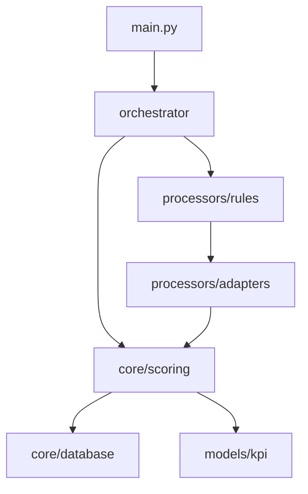

# src_check → KPI システム移行計画 - アーキテクト視点

## 1. アーキテクチャ概要

### 1.1 現状アーキテクチャ
```
src_check/
├── main.py               # エントリーポイント
├── core/                 # コア機能
├── processors/rules/     # チェックルール
├── models/              # データモデル
└── orchestrator/        # 実行制御
```

### 1.2 目標アーキテクチャ
```
src_check/
├── main.py              # 既存エントリーポイント（互換性維持）
├── kpi_main.py          # 新KPIエントリーポイント
├── core/                # 既存コア + KPI拡張
│   ├── scoring/         # スコアリングエンジン（新規）
│   ├── database/        # データベース層（新規）
│   └── analytics/       # 分析エンジン（新規）
├── processors/          # 既存ルール + KPIアダプター
├── models/              # 既存モデル + KPIモデル
├── agents/              # 自動改善エージェント（新規）
└── api/                 # REST/CLI API（新規）
```

## 2. コンポーネント設計

### 2.1 スコアリングエンジン
```python
# core/scoring/engine.py
class KPIScoreEngine:
    def __init__(self):
        self.base_score = 50
        self.weights = {
            'code_quality': 0.333,
            'architecture_quality': 0.333,
            'test_quality': 0.334
        }
    
    def calculate_score(self, check_results: List[CheckResult]) -> KPIScore:
        """CheckResultをKPIスコアに変換"""
        pass
```

### 2.2 データベース層
```python
# core/database/models.py
class KPIHistory(Base):
    __tablename__ = 'kpi_history'
    
    id = Column(Integer, primary_key=True)
    timestamp = Column(DateTime, default=datetime.utcnow)
    project_path = Column(String)
    total_score = Column(Float)
    code_quality_score = Column(Float)
    architecture_quality_score = Column(Float)
    test_quality_score = Column(Float)
    details = Column(JSON)
```

### 2.3 アダプター層
```python
# processors/adapters/kpi_adapter.py
class CheckResultToKPIAdapter:
    """既存のCheckResultをKPIスコアリングに適応"""
    
    def adapt(self, result: CheckResult) -> ScorableItem:
        return ScorableItem(
            category=self._determine_category(result),
            severity=self._map_log_level_to_severity(result.log_level),
            impact_points=self._calculate_impact(result)
        )
```

## 3. 移行フェーズ

### Phase 1: 基盤構築（週1-2）
- [ ] KPIモデル定義
- [ ] スコアリングエンジン基本実装
- [ ] データベース層実装
- [ ] 単体テスト作成

### Phase 2: 統合層実装（週2-3）
- [ ] CheckResult → KPIアダプター
- [ ] 並列実行モード実装
- [ ] API層実装
- [ ] 統合テスト作成

### Phase 3: 高度機能実装（週3-4）
- [ ] 時系列分析機能
- [ ] パターン検出（AST解析）
- [ ] エージェント基盤
- [ ] レポート生成

### Phase 4: 移行完了（週4）
- [ ] パフォーマンス最適化
- [ ] ドキュメント整備
- [ ] 旧システムの段階的廃止計画

## 4. 技術的課題と解決策

### 4.1 パフォーマンス
**課題**: AST解析とスコア計算の処理時間
**解決策**: 
- 増分解析の実装
- 結果キャッシング
- 並列処理の活用

### 4.2 スケーラビリティ
**課題**: 大規模プロジェクトでのメモリ使用量
**解決策**:
- ストリーミング処理
- 分散実行オプション
- データベースインデックス最適化

### 4.3 拡張性
**課題**: 新しいチェックルールの追加
**解決策**:
- プラグインアーキテクチャ
- 設定ファイルによるカスタマイズ
- ルール開発用SDK

## 5. モジュール構造詳細

### 5.1 コアモジュール間の依存関係


### 5.2 データフロー
1. `main.py` → `orchestrator` → `processors/rules`
2. `CheckResult` → `adapters` → `ScorableItem`
3. `ScorableItem` → `scoring/engine` → `KPIScore`
4. `KPIScore` → `database` → 永続化

## 6. API設計

### 6.1 REST API
```yaml
/api/v1/kpi:
  get:
    parameters:
      - project_path
      - date_range
    returns: KPIHistory[]
  
  post:
    body: CheckRequest
    returns: KPIScore

/api/v1/kpi/trends:
  get:
    parameters:
      - project_path
      - metric_type
    returns: TrendAnalysis
```

### 6.2 CLI拡張
```bash
# 既存コマンド（互換性維持）
python -m src_check

# 新KPIコマンド
python -m src_check --kpi
python -m src_check --kpi --format json
python -m src_check --kpi --history
```

## 7. 技術スタック

- **Database**: SQLite（組み込み）/ PostgreSQL（エンタープライズ）
- **API Framework**: FastAPI
- **AST解析**: Python ast + astroid
- **並列処理**: multiprocessing + asyncio
- **キャッシュ**: Redis（オプション）

## 8. 成功指標

- 既存機能の100%互換性維持
- KPIスコア計算時間 < 5秒（中規模プロジェクト）
- メモリ使用量増加 < 20%
- 90%以上のコードカバレッジ