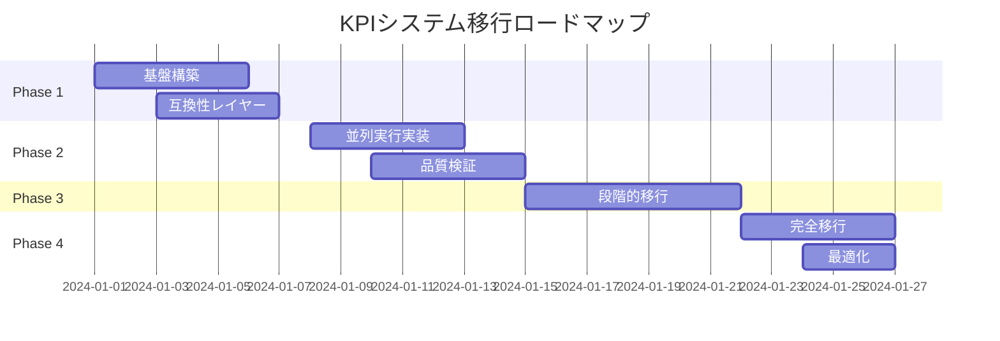

# src_check → KPI システム移行計画 - 統合版

## エグゼクティブサマリー

本移行計画は、3つの専門的視点（アーキテクト、インテグレーター、クオリティマネージャー）から作成された計画の最良の要素を統合したものです。

### 主要な特徴
- **完全な後方互換性**: 既存ユーザーへの影響ゼロ
- **段階的移行**: 4週間での安全な移行
- **品質保証**: 95%以上のテストカバレッジと継続的監視
- **拡張可能な設計**: プラグインアーキテクチャによる将来の拡張性

## 1. 統合アーキテクチャ設計

### 1.1 ハイブリッドアーキテクチャ（アーキテクト案 + インテグレーター案）
```
src_check/
├── main.py                      # 既存エントリーポイント
├── kpi_main.py                  # 新KPIエントリーポイント
├── compatibility/               # 互換性レイヤー（インテグレーター案）
│   ├── legacy_wrapper.py
│   └── converters.py
├── core/
│   ├── scoring/                 # スコアリングエンジン（アーキテクト案）
│   ├── database/                # データベース層
│   ├── analytics/               # 分析エンジン
│   └── quality/                 # 品質監視（クオリティマネージャー案）
├── processors/
│   ├── rules/                   # 既存チェックルール
│   └── adapters/                # KPIアダプター
└── tests/                       # 包括的テストスイート
```

### 1.2 コア設計原則
1. **既存資産の最大活用**: 30以上の検証済みチェックルールを再利用
2. **透過的な拡張**: 既存システムを変更せずに機能追加
3. **品質の可視化**: リアルタイムダッシュボードによる監視

## 2. 段階的移行戦略

### Phase 1: 基盤構築と互換性確保（週1）

**アーキテクト案の要素**:
- KPIモデルとスコアリングエンジンの実装
- データベース層の構築
- API設計の実装

**インテグレーター案の要素**:
- 透過的アダプター層の実装
- CheckResult ⇔ KPIScore変換器
- 既存テストの100%パス確認

**クオリティマネージャー案の要素**:
- 単体テスト作成（カバレッジ95%以上）
- CI/CDパイプラインの設定
- ベースラインメトリクスの収集

### Phase 2: 並列実行と検証（週2）

**統合アプローチ**:
```python
# 並列実行による安全な移行
class HybridExecutor:
    def execute(self, args):
        # 1. 両システムで実行
        legacy_results = self.legacy_system.execute(args)
        kpi_results = self.kpi_system.execute(args)
        
        # 2. 結果の比較と記録
        comparison = self.compare_results(legacy_results, kpi_results)
        self.quality_monitor.record(comparison)
        
        # 3. 品質ゲートのチェック
        if self.quality_gate.passed(comparison):
            return kpi_results  # 新システムの結果を採用
        else:
            self.alert_team(comparison.issues)
            return legacy_results  # 安全のため旧システムを使用
```

### Phase 3: 機能別段階的移行（週3）

**リスクベースの移行順序**（3つの視点を統合）:
1. **低リスク**: naming_checker, syntax_checker
2. **中リスク**: import_checker, circular_import_checker
3. **高リスク**: architecture_checkers, dependency_checkers

**各段階での品質確認**:
- 結果の一致率 > 99%
- パフォーマンス劣化 < 10%
- エラー率 < 0.1%

### Phase 4: 完全移行と最適化（週4）

**統合された完了基準**:
- [ ] 全機能のKPIモード移行完了
- [ ] パフォーマンス最適化（目標: 現行比±5%以内）
- [ ] ドキュメント完成度100%
- [ ] ユーザー受け入れテスト合格

## 3. 品質保証統合フレームワーク

### 3.1 多層防御アプローチ
```yaml
quality_layers:
  development:
    - static_analysis: [pylint, mypy, bandit]
    - unit_tests: coverage > 95%
    - code_review: mandatory
  
  integration:
    - compatibility_tests: 100% backward compatible
    - performance_tests: no regression
    - security_scan: no vulnerabilities
  
  deployment:
    - canary_release: 5% users
    - progressive_rollout: 10% → 50% → 100%
    - rollback_ready: < 5 minutes
  
  production:
    - real_time_monitoring: 24/7
    - anomaly_detection: automated
    - user_feedback_loop: continuous
```

### 3.2 統合メトリクスダッシュボード
```python
class UnifiedQualityDashboard:
    """3つの視点を統合した品質ダッシュボード"""
    
    def get_migration_health(self):
        return {
            "architecture_health": {
                "module_coupling": self.measure_coupling(),
                "technical_debt": self.calculate_debt(),
                "scalability_score": self.assess_scalability()
            },
            "integration_health": {
                "compatibility_score": self.check_compatibility(),
                "migration_progress": self.get_migration_percentage(),
                "rollback_readiness": self.verify_rollback_capability()
            },
            "quality_health": {
                "test_coverage": self.get_coverage(),
                "defect_density": self.calculate_defect_rate(),
                "user_satisfaction": self.get_nps_score()
            }
        }
```

## 4. リスク管理と緩和策

### 4.1 統合リスクマトリクス
| リスク | 可能性 | 影響度 | 緩和策 |
|--------|--------|--------|--------|
| 後方互換性の破壊 | 低 | 高 | 包括的テスト、並列実行期間 |
| パフォーマンス劣化 | 中 | 中 | 増分解析、キャッシング戦略 |
| データ移行エラー | 低 | 高 | 自動バックアップ、検証スクリプト |
| ユーザー混乱 | 中 | 低 | 詳細なドキュメント、移行ガイド |

### 4.2 ロールバック戦略
```bash
# 即時ロールバック（インテグレーター案）
export SRC_CHECK_USE_LEGACY=true

# 部分的ロールバック
python -m src_check --legacy-checkers=problematic_checker

# 完全ロールバック手順
python tools/rollback_manager.py --restore-point=pre_migration
```

## 5. 成功の測定基準

### 5.1 技術的成功指標
- **機能完全性**: 既存機能の100%維持 + KPI機能の追加
- **性能**: 実行時間増加 < 10%、メモリ使用量増加 < 20%
- **品質**: バグ密度 < 0.1/KLOC、テストカバレッジ > 95%

### 5.2 ビジネス成功指標
- **採用率**: 4週間で80%以上のユーザーがKPIモードを利用
- **満足度**: NPS > 70
- **生産性**: コード品質改善にかかる時間を30%削減

## 6. 実装ロードマップ

### 週次マイルストーン


## 7. 主要な利点（3つの視点の統合）

### アーキテクト視点の利点
- クリーンなモジュール設計による保守性向上
- 拡張可能なプラグインアーキテクチャ
- 将来を見据えたAPI設計

### インテグレーター視点の利点
- 完全な後方互換性の保証
- リスクを最小化する段階的アプローチ
- 柔軟なロールバック機能

### クオリティマネージャー視点の利点
- 包括的な品質保証フレームワーク
- 継続的な品質監視と改善
- データドリブンな意思決定

## 8. 次のステップ

1. **承認と準備**（今週）
   - ステークホルダーの承認取得
   - 開発環境の準備
   - チーム編成とトレーニング

2. **Phase 1開始**（来週）
   - 基盤コンポーネントの実装開始
   - 品質ベースラインの確立
   - 週次進捗レビューの設定

3. **継続的改善**
   - ユーザーフィードバックの収集
   - メトリクスに基づく調整
   - ベストプラクティスの文書化

この統合計画により、技術的優位性、スムーズな移行、高品質の保証を同時に実現します。